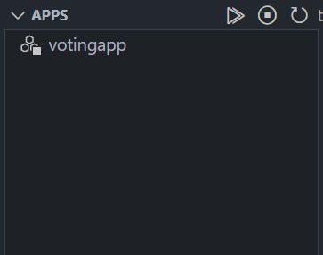
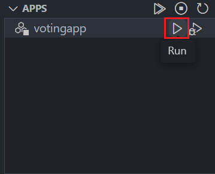
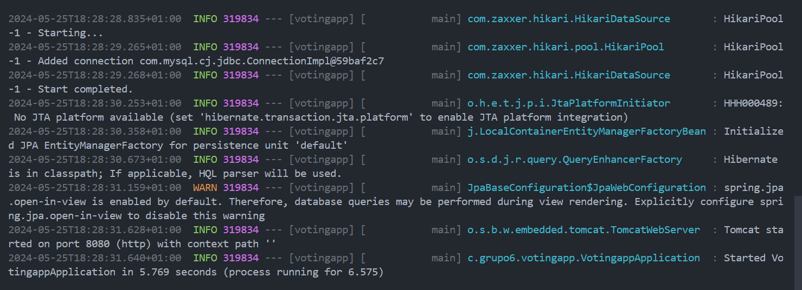

# Manual do servidor aplicacional

## Executar o servidor

### (Apenas para vscode) Com a extensão Springboot do Springboot Extension Pack

1. Instalar o seguinte *extension pack* no caso de não ter instalado.   


2. Transferir o ficheiro da *serviceaccount* (que está nesta [mensagem](https://discord.com/channels/1198308313096536201/1243879448949035098/1245123722650718249) do grupo de Discord) para a diretoria `src/main/resources` do servidor aplicacional.


3. No lado esquerdo da janela do vscode, deve aparecer o seguinte ícone ao abrir algum ficheiro Java no vscode e de seguida clicar nele:
<div style="display: flex; justify-content: center">

</div>

4. Se algum dos ficheiros Java do servidor aplicacional estiver aberto, deverá aparecer o seguinte na parte de cima (no lado esquerdo):
<div style="display: flex; justify-content: center">

</div>

5. Clicar no seguinte ícone destacado a vermelho para inicializar a aplicação:
<div style="display: flex; justify-content: center">

</div>

6. O servidor começará a apresentar vários logs. Eis um exemplo:
<div style="display: flex; justify-content: center">

</div>

<br>

**Notas importantes**:
- O servidor deve arrancar com a base de dados ligada. Se tal não acontecer, dá erro e termina.

### Executar com shell script
Dentro da directoria "[Trabalho-AA-SIC-2023-2024/AppVotos/app/votingapp/](../app/votingapp/)" existe uma script `run.sh` que compila e executa o servidor aplicacional.

Para executar a script é só correr o seguinte comando:
```
./run.sh
```
Ou, em alternativa, o seguinte comando:
```
bash ./run.sh
```