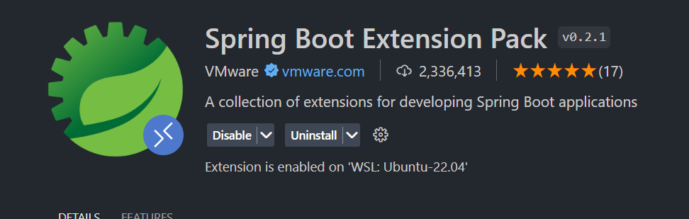

# Manual do servidor aplicacional

## Executar o servidor

### (Apenas para vscode) Com a extensão Springboot do Springboot Extension Pack

1. Instalar o seguinte *extension pack* no caso de não ter instalado.   


2. Transferir o ficheiro da *serviceaccount* (que está nesta [mensagem](https://discord.com/channels/1198308313096536201/1243879448949035098/1245123722650718249) do grupo de Discord) para a diretoria `src/main/resources` do servidor aplicacional.

3. Fazer docker pull da imagem mysql, caso não a tenham ainda:
```bash
docker pull mysql
```

4. Correr a seguinte script que cria um container docker com a base de dados e cria a base de dados `votingapp` necessária à aplicação:
```bash
#!/bin/bash

# Variáveis
DB_NAME="votingapp"
DB_USER="root"
DB_PASS="mysql"


docker run -d \
   --name mysql \
   -e MYSQL_ROOT_PASSWORD=$DB_PASS \
   -p 3306:3306 \
   -v mysql_data:/var/lib/mysql \
   mysql

sleep 1
docker exec -it mysql mysql -p$DB_PASS -e "CREATE DATABASE $DB_NAME;"
# docker exec -it mysql mysql -u root -pmysql -e "CREATE DATABASE votingapp;"
```


5. No lado esquerdo da janela do vscode, deve aparecer o seguinte ícone ao abrir algum ficheiro Java no vscode e de seguida clicar nele:
<div style="display: flex; justify-content: center">

</div>

6. Se algum dos ficheiros Java do servidor aplicacional estiver aberto, deverá aparecer o seguinte na parte de cima (no lado esquerdo):
<div style="display: flex; justify-content: center">

</div>

7. Clicar no seguinte ícone destacado a vermelho para inicializar a aplicação:
<div style="display: flex; justify-content: center">

</div>

8. O servidor começará a apresentar vários logs. Eis um exemplo:
<div style="display: flex; justify-content: center">

</div>

<br>

**Notas importantes**:
- O servidor deve arrancar com a base de dados ligada. Se tal não acontecer, dá erro e termina.

### Executar com shell script
Dentro da directoria "[Trabalho-AA-SIC-2023-2024/AppVotos/app/votingapp/](../app/votingapp/)" existe uma script `run.sh` que compila e executa o servidor aplicacional.

Para executar a script é só correr o seguinte comando:
```
./run.sh
```
Ou, em alternativa, o seguinte comando:
```
bash ./run.sh
```